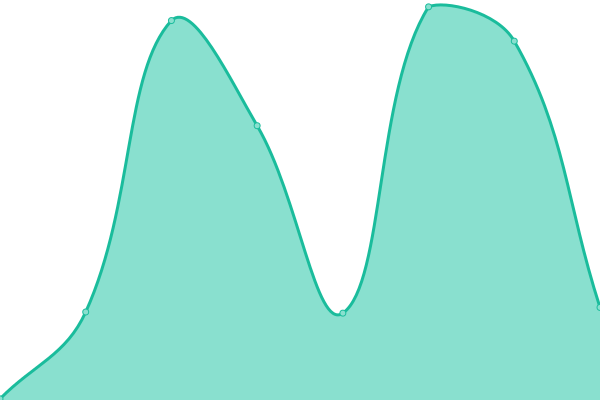

# [📈 Live Status](https://meething.github.io/uptime): <!--live status--> **🟩 All systems operational**

This repository contains the open-source uptime monitor and status page for [Meething dWebRTC](https://meething.space), powered by [Upptime](https://github.com/upptime/upptime).

With [Upptime](https://upptime.js.org), you can get your own unlimited and free uptime monitor and status page, powered entirely by a GitHub repository. We use [Issues](https://github.com/meething/uptime/issues) as incident reports, [Actions](https://github.com/meething/uptime/actions) as uptime monitors, and [Pages](https://meething.github.io/uptime) for the status page.

<!--start: status pages-->
<!-- This summary is generated by Upptime (https://github.com/upptime/upptime) -->
<!-- Do not edit this manually, your changes will be overwritten -->
<!-- prettier-ignore -->
| URL | Status | History | Response Time | Uptime |
| --- | ------ | ------- | ------------- | ------ |
|  [Meething Site](https://meething.space) | 🟩 Up | [meething-site.yml](https://github.com/meething/uptime/commits/master/history/meething-site.yml) | 

 300ms
     
 | 

<a href="https://meething.github.io/uptime/history/meething-site">100.00%</a>
    

|  [US Meething](https://us.meething.space) | 🟩 Up | [us-meething.yml](https://github.com/meething/uptime/commits/master/history/us-meething.yml) | 

 92ms
     
 | 

<a href="https://meething.github.io/uptime/history/us-meething">100.00%</a>
    

|  [EU Meething](https://eu.meething.space) | 🟩 Up | [eu-meething.yml](https://github.com/meething/uptime/commits/master/history/eu-meething.yml) | 

 410ms
     
 | 

<a href="https://meething.github.io/uptime/history/eu-meething">100.00%</a>
    

<!--end: status pages-->

[**Visit our status website →**](https://meething.github.io/uptime)

## 📄 License

- Powered by: [Upptime](https://github.com/upptime/upptime)
- Code: [MIT](./LICENSE) © [Meething dWebRTC](https://meething.space)
- Data in the `./history` directory: [Open Database License](https://opendatacommons.org/licenses/odbl/1-0/)
